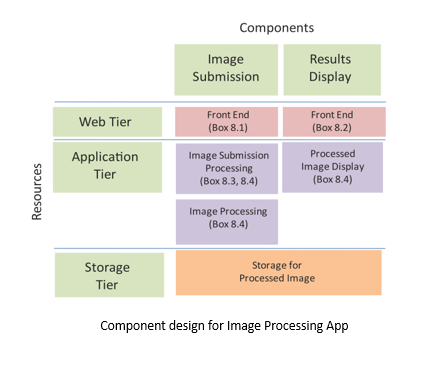

# Cloud-based Image Processing Application

## Introduction

This is an image processing application deployed on AWS EC2 instance with image filtering capability.

## Requirements

Functionality:
* Users upload image files 
* Choose the filters to apply.
* Selected filters are applied to the image 
* Processed image can then be downloaded.

## Design

* Component Design
    * Web Tier: The web tier for the image processing app has front ends for image submission and displaying processed images.
    * Application Tier: The application tier has components for processing the image submission requests, processing the submitted image and processing requests for displaying the results.
    * Storage Tier: The storage tier comprises of the storage for processed images.

* Deployment Design:
    * The final deployment should be like below: The website should be the public IP address of your EC2 machine which serves as the web server. 




## Usage guide 

Boot up the "server" in AWS
    
```bash
$ cd <project-folder>
$ python manage.py runserver 0.0.0.0:8000
```

Go to web browser:
```bash
<ec2-instance-name>:8000
```

## Contribution:

Khai Nguyen - khainguyen@temple.edu