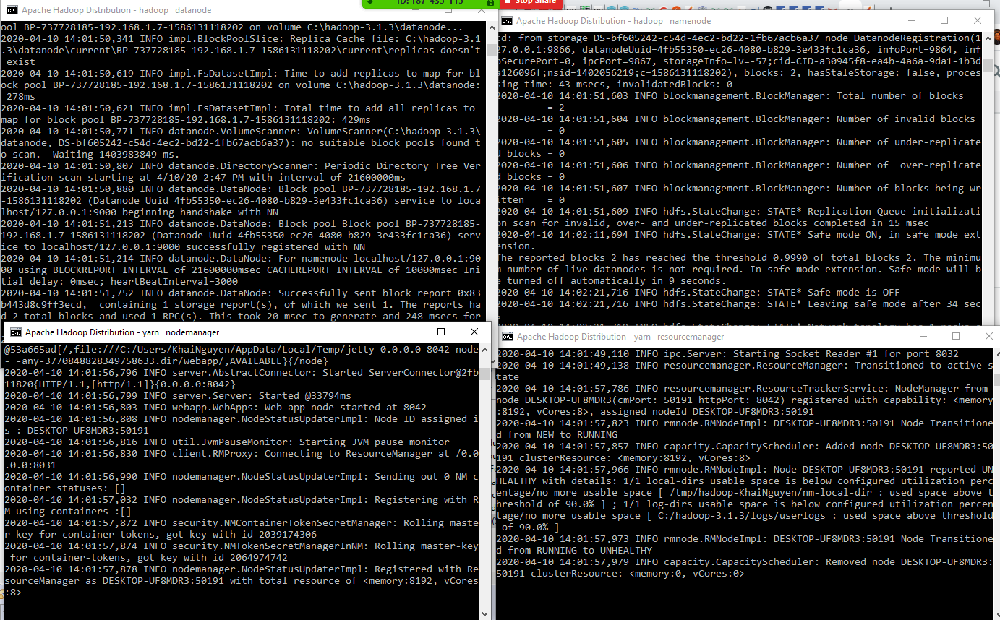

# MapReduce_and_Hadoop
Project 4: WordCount with MapReduce and Hadoop

## Introduction
A tool for counting words in large text files using MapReduce and Hadoop Filesystem on Windows.

## Requirements

## Installation
* Java 1.8.0_241
* Hadoop 3.1.3
* Mapreduce Java libraries: **hadoop-core-0.20.0** and **commons-cli-1.2**

Reference link: https://dev.to/awwsmm/installing-and-running-hadoop-and-spark-on-windows-33kc?fbclid=IwAR3T_Ath1od13LTPPFuPZhtvvuH54Xfh8XV7biDbrL4g9_6uDOBbuW0SWCQ

## Guide 

Note: these are Windows cmds

```bash
$ cd <sbin folder of Hadoop>
$ start-all.cmd
```

Check datanode, namenode, resource manager and nodemanager are up and running.




Create a folder to store files & cd into fiolder with text file with words to be counted. Upload the file
```bash
$ hadoop fs -mkdir <storageFolderOnHDFS>
$ cd <folder with file>
$ hadoop fs -put <fileName.txt> <storageFolderOnHDFS>

Check if file is uploaded
$ hadoop fs -cat <storageFolderOnHDFS>/<fileName.txt>
```

Produce & go to the folder of your .jar file to perform mapReduce
```bash
$ cd <folder with .jar file>
$ hadoop jar <jarFileName.jar> <packageName.ClassName>  <PathToInputTextFile> <PathToOutputDirectry>

To check reuslts of <storageFolderOnHDFS>, which normally has its path as /user/<username>/<PathToOutputDirectry>
$ hadoop fs -ls <PathToOutputDirectry>
```

Sort and download the merged file.
```bash
$ hadoop fs -cat <PathToOutputDirectry>/part-r-* | sort > ./<localOutputFolder>/<merged.txt>
```
View number of words OR number of lines since each line is designated for 1 word
```bash
$ find /c /v "" "<localOutputFolder>/<merged.txt>"
```
A run-through example can be viewed in the **Report** folder.

Windows cmds reference: https://dzone.com/articles/top-10-hadoop-shell-commands

## Contributors
Khai Nguyen: khainguyen@temple.edu
