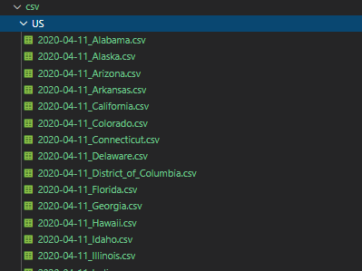

# Overview 
This folder consists of a Web Scraping and PDF Scraping tool, generating csv data from Google's COVID 19 Mobility Report https://www.google.com/covid19/mobility/ to serve ongoing research efforts to fight against COVID-19.

# Requirements
* BeautifulSoup4 : https://pypi.org/project/beautifulsoup4/
* python tika : https://pypi.org/project/tika/

# Building blocks
* scrapeWeb.py 
* scrapePDFtoCSV.py

Important functions in scrapePDFtoCSV.py: 
- processBigTerritory(metric_list, file_name)
- processSmallTerritory(stop_index, metric_list, file_name)
- scrapePDFtoCSV(path_to_file)

# Workflow
- Implement scrapeWeb.py with BeautifulSoup to pull all the pdf's down
- Start building scrapePDFtoCSV.py by searching for a pdf extraction tool
- Break down into 2 steps, inner-file processing and file-name processing
- Build getCountryName() function
- Build processBigTerritory() function
- Build processSmallTerritory() function
- Build scrapePDFtoCSV() with a sample pdf
- Build scrapePDFtoCSV() to process all pdfs in a folder
- Format csv output files


# Testing
* Incremental testing when implement new feature, no assumptions

# Installation (on Linux)
* BeatifulSoup4

```bash
$ pip install beautifulsoup4
``` 

* tika
```bash
$ pip install tika
```

# Usage: 

For downloading all pdf file from Google's site

```bash
$ python scrapeWeb.py
```

NOTICE! Remember to pre-create the "./csv" and "./csv/US" folder before proceeding!

For scraping data from PDF to CSV, you can either execute the program through Jupyter notebook tika-extraction.ipynb, or cmd line as below

```bash
$ python scrapePDFtoCSV.py
```


# Issues
* not declaring encoding type when read/write files, the choice would be UTF-8
* processing strings: wrong path, or "\n" not truncated
* text processing issues, delimiters, regex
* csv formatting
* Time management

# Contribution
* Khai Nguyen (カイ∙グエン):  khainguyen@temple.edu